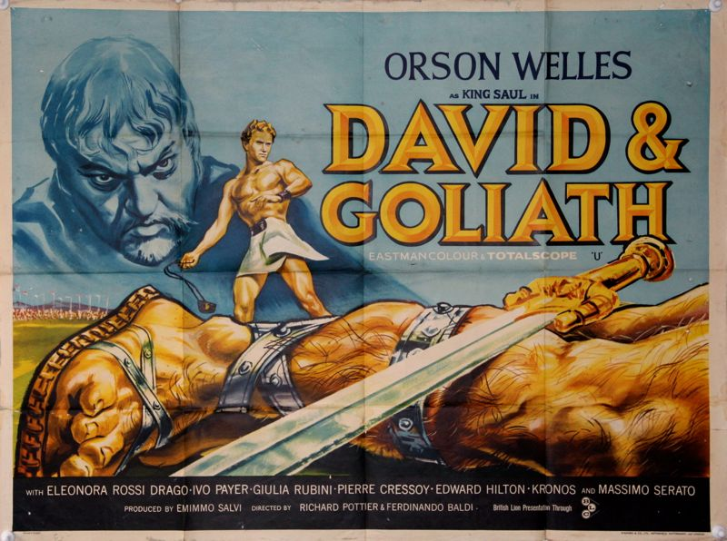
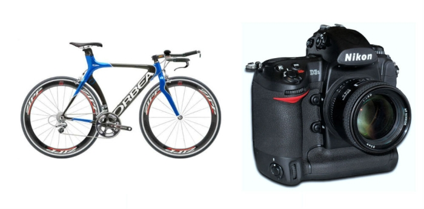
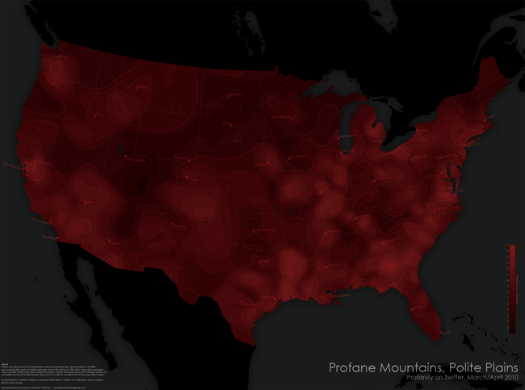
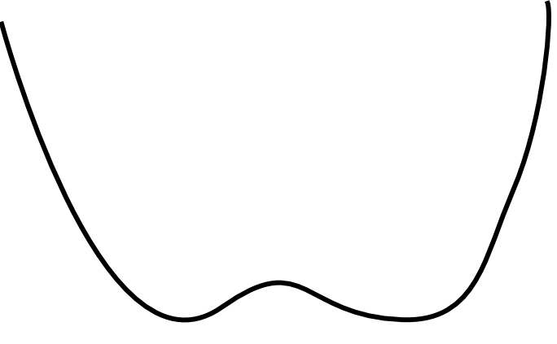
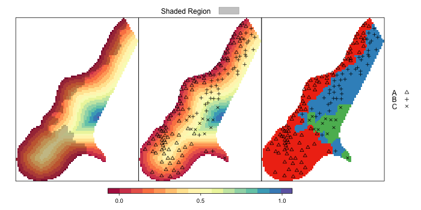
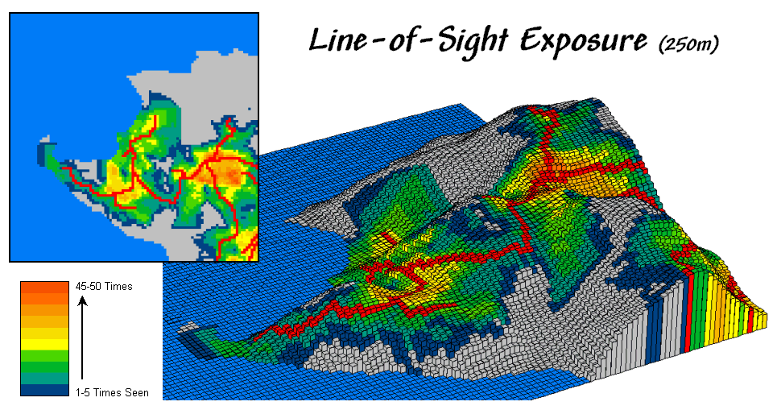

SmallData > BigData
===================================

---

---

Los datos son menos importantes de lo que piensas

---

"Shed a small tear for desktop GIS specialists who have spent years honing their satellite imagery skills..."

---

"Your software is awesome, but it is useless without data" 
<i>-Schuyler Erle</i>

---

"Your data is awesome, but is useless without knowledge"

---

"It’s like that basic rule in nutrition: Food that is not eaten has no nutritional value. Data which is not understood has no value" 
<i>-Hans Rosling</i>

---

Conocimiento/experiencia > datos > software

---

Tiempo de vida

---

---

---

Es muy facil obtener malos resultados con datos excelentes

---

Es más dificil darse cuenta de un mal resultado si los datos son buenos o muy abundantes

---

Los datos han de ser completos, representativos, actuales...

---

BigData no implica necesariamente NADA de lo anterior

---

¿La sociedad de la información?

---

"BigData no es BigInformation" 
<i>-Agustín Lobo</i>

---

¿Qué pasa con el muestreo de datos?

---

---

Efectos colaterales

---

Los datos parecen más importantes de lo que en realidad son

---

Falsa sensación de precisión

---

Falsa dependencia de las propiedades de los datos

---

El uso de grandes cantidades de datos no debe excluir el uso de otros menos voluminosos

---

---

Los datos son importantes para el aprendizaje de las técnicas.

---

---

“I didn't ask my mother to buy me a trumpet or a violin. I started right on the water hose.” 
<i>–Rahsaan Roland Kirk</i>

---

---

---

---

---

Propuestas (para usuarios)

---

Criterio

---

Modelizacion con otros datos

---

Menos es más

---

Propuestas (para desarrolladores)

---

"Programming today is a race between software engineers striving to build bigger and better idiot-proof programs, and the Universe trying to produce bigger and better idiots. So far, the Universe is winning" 
<i>Rick Cook</i>

---

Estamos creando usuarios que sobreestiman las capacidades del software...

---

... y confian excesivamente en los datos que usan

---

¿Interfaces para tontos?

---

¿Democratizar uso de datos?

---

---

¡Gracias!
---------

volaya@opengeo.org

